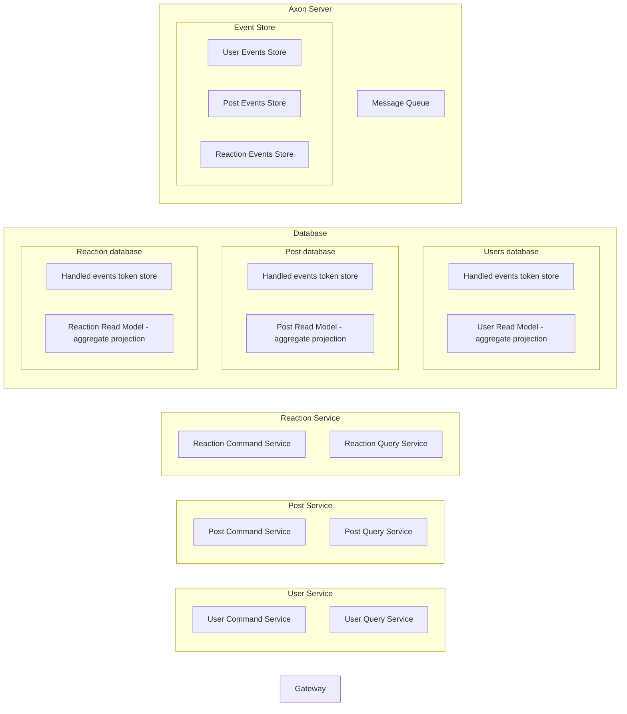

# Development View

* software engineer
* manager

* component

```mermaid
flowchart LR
    g[Gateway]

    subgraph u[User Service]
        uc[User Command Service]
        uq[User Query Service]
    end

    subgraph p[Post Service]
        pc[Post Command Service]
        pq[Post Query Service]
    end

    subgraph r[Reaction Service]
        rc[Reaction Command Service]
        rq[Reaction Query Service]
    end

    subgraph db[Database]
        subgraph dbu[Users database]
            tsu[Handled events token store]
            rmu[User Read Model - aggregate projection]
        end

        subgraph dbp[Post database]
            tsp[Handled events token store]
            rmp[Post Read Model - aggregate projection]
        end

        subgraph dbl[Reaction database]
            tsl[Handled events token store]
            rml[Reaction Read Model - aggregate projection]
        end
    end

    subgraph axon[Axon Server]
        subgraph es[Event Store]
            esu[User Events Store]
            esp[Post Events Store]
            esl[Reaction Events Store]
        end
        mq[Message Queue]
    end
```
