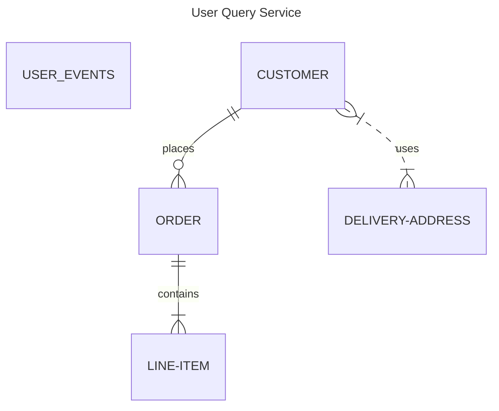
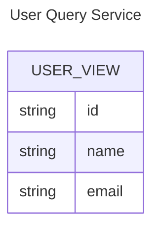

# Logical View

* end user / customer

* class
* object
* package
* composite
* state machine

TODO: create more advanced

```mermaid
---
title: User Query Service
---
erDiagram
    USER_EVENTS
    
    
    CUSTOMER ||--o{ ORDER : places
    ORDER ||--|{ LINE-ITEM : contains
    CUSTOMER }|..|{ DELIVERY-ADDRESS : uses
```

```mermaid
---
title: User Query Service
---
erDiagram
    USER_VIEW {
        string id
        string name
        string email
    }
```
