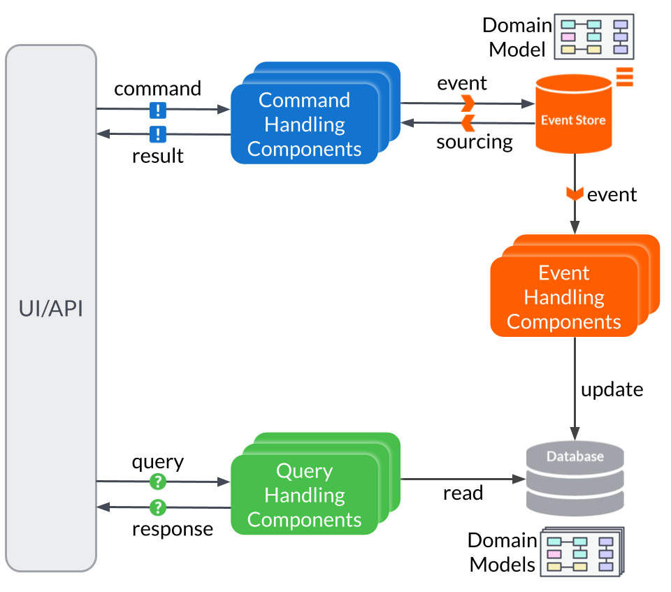
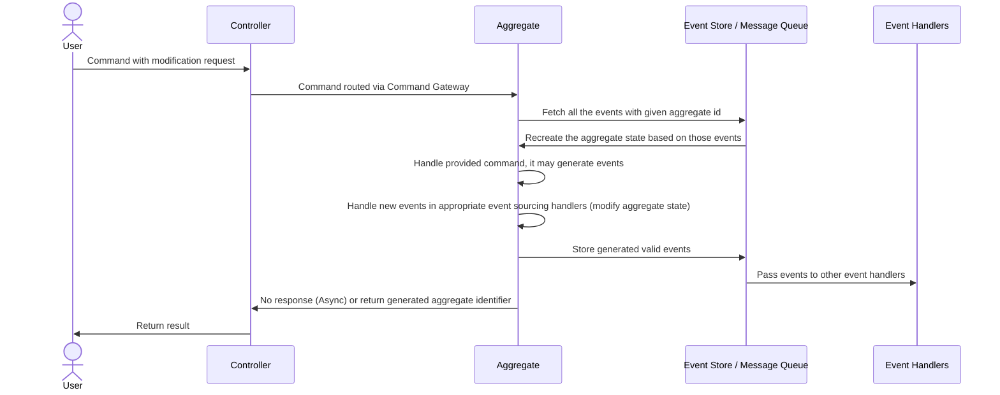
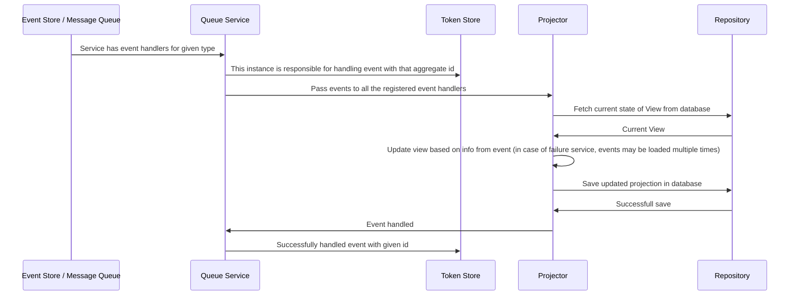
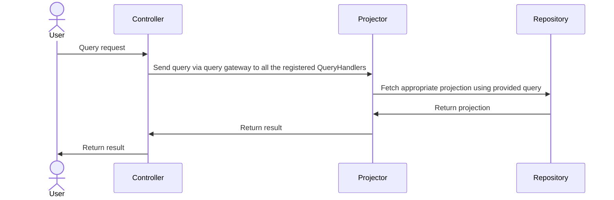

# Process View

* Solution architect

* Sequence
* Communication
* Activity
* Timing
* Interaction overview

<figure><figcaption>
<a href="https://docs.axoniq.io/reference-guide/architecture-overview">https://docs.axoniq.io/reference-guide/architecture-overview</a>
</figcaption></figure>

Micro-service main component communication

* command handling

* query service updating the state

* querying the query service

