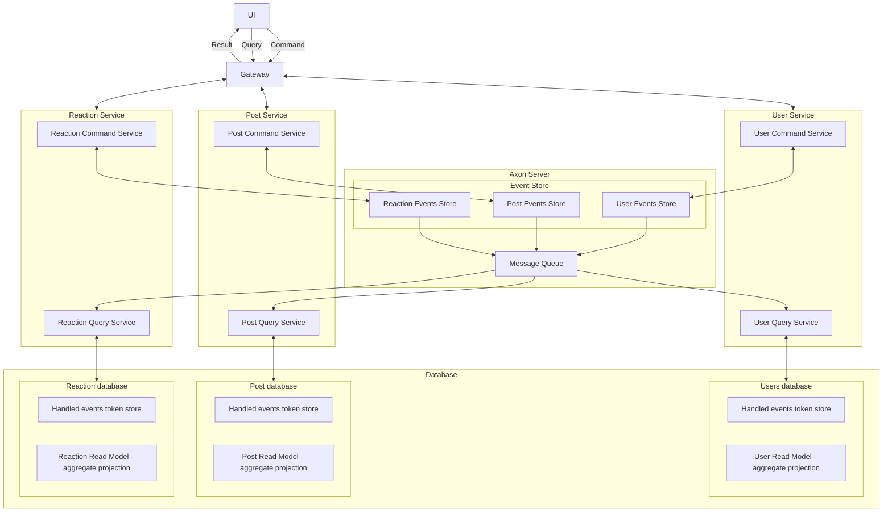

# Psychical View

* Software architect

* Deployment

Almost deployment view

```mermaid
flowchart TB
    ui[UI]

    g[Gateway]

    ui --Command--> g
    ui --Query--> g
    g --Result--> ui

    subgraph u[User Service]
        uc[User Command Service]
        uq[User Query Service]
    end

    subgraph p[Post Service]
        pc[Post Command Service]
        pq[Post Query Service]
    end

    subgraph r[Reaction Service]
        rc[Reaction Command Service]
        rq[Reaction Query Service]
    end

    g <--> u
    g <--> p
    g <--> r

    subgraph db[Database]
        subgraph dbu[Users database]
            tsu[Handled events token store]
            rmu[User Read Model - aggregate projection]
        end

        subgraph dbp[Post database]
            tsp[Handled events token store]
            rmp[Post Read Model - aggregate projection]
        end

        subgraph dbl[Reaction database]
            tsl[Handled events token store]
            rml[Reaction Read Model - aggregate projection]
        end
    end

    uq <--> dbu
    pq <--> dbp
    rq <--> dbl

    subgraph axon[Axon Server]
        subgraph es[Event Store]
            esu[User Events Store]
            esp[Post Events Store]
            esl[Reaction Events Store]
        end
        mq[Message Queue]
    end

    uc <--> esu
    pc <--> esp
    rc <--> esl

    esu --> mq
    esp --> mq
    esl --> mq

    mq --> uq
    mq --> pq
    mq --> rq
```
